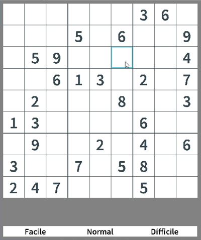
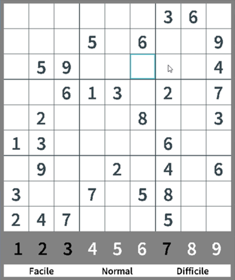
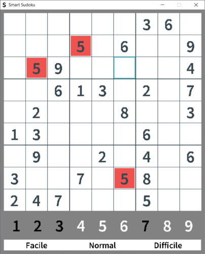
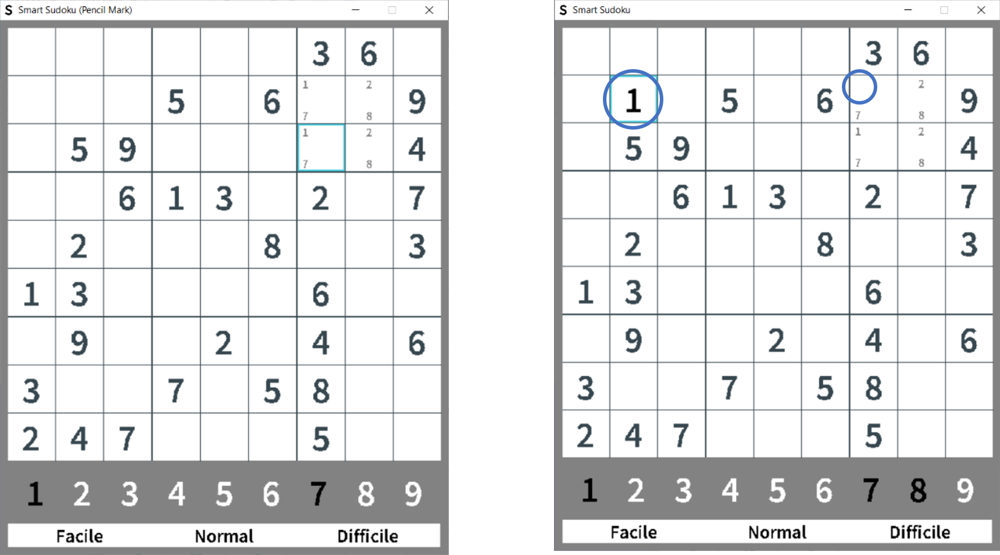

# Smart Sudoku
Smart Sudoku coded with C and the SDL2.0 library. Works only on windows.

##### Table of Contents
- [Tools used]()
- [Overview](#overview)
  * [Difficulties](#difficulties)
  * [Highlight](#highlight)
  * [Select a cell](#select-a-cell)
  * [Unselect a cell](#unselect-a-cell)
  * [Enter a number](#enter-a-number)
  * [Hints](#hints)
  * [Deleting the content of a cell](#deleting-the-content-of-a-cell)
  * [Cancel the last actions](#cancel-the-last-actions)
- [How to build the game](#how-to-build-the-game)
- [How to launch the game](#how-to-launch-the-game)

## Tools used

- JetBrains CLion Integrated Development Environment : [Official website](https://www.jetbrains.com/clion/)
- SDL2.0 Library : [Download link](https://www.libsdl.org/download-2.0.php)

## Overview

The goal of this project was to create a smart Sudoku.
The goal was to block not allowed numbers to be written based on the existing numbers in the grid.

### Difficulties

The game offers 3 difficulties : easy, normal and hard.
The player can load a new grid by pressing the difficulty buttons at the bottom of the window.

The grids are stored in files in the ``grid/<difficulty>`` folder.
You can add your own grids by naming them ``grid<number>.txt`` in the respective folder.
They must have the same layout as the original ones.

### Highlight
The program integrates highlight on navigation with a blue outline :

*Blue outline on the cell hovered on the mouse*

### Select a cell

The user can select a cell by left clicking it.
The selected cell will stay highlighted independently from the mouse position.
The possible numbers from 0 to 9 will appear at the bottom. Black numbers are allowed when white ones aren't.

*Possible numbers for the selected cell*

### Unselect a cell

The user can unselect a cell by clicking outside of the grid, selecting another cell or by pressing the <kbd>Escape</kbd> key.

### Enter a number

The user can enter the number with numbers on his keyboard, the number pad and by clicking the numbers below the grid.
If the number is allowed, it is displayed in the cell and updates other hints.
Else, the blocking numbers will be displayed on a red background.

*I tried to enter 5 but there is already one on the line, one on the column and one in the group*

### Hints

By pressing the <kbd>Caps lock</kbd> key, You enter the hint mode.
He can now type multiple hints, while respecting possible values.
The hint mode is shown with the "(pencil mark)" mention in the title of the window.

If the user enter a hint already present, the hint will be deleted.

If the user enter a number in the grid, all associated hints will be deleted.

*By typing 1, the 1 hints from the line is deleted.
Also, we see the different titles between when in hint mode and number mode*

### Deleting the content of a cell

The user can delete the content of the cell (hints or number) by pressing the <kbd>Backwards</kbd> or <kbd>Delete</kbd> key.

### Cancel the last actions

The player can restore the previous grid state by pressing <kbd>Ctrl</kbd>+<kbd>Z</kbd>. This action can be repeated until the player has an empty grid.

## How to build the game
Download or copy this repository. Then launch Clion and select the folder. Build and enjoy!

## How to launch the game
Download or copy this repository. Then go to the cmake-build-debug folder and launch **untitled.exe**.
